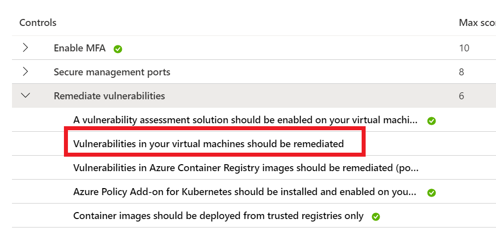
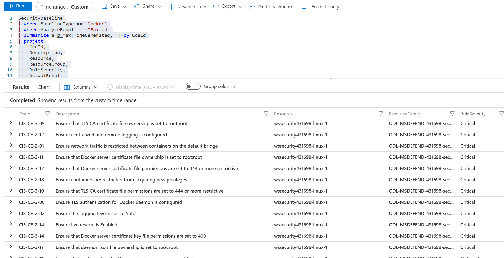
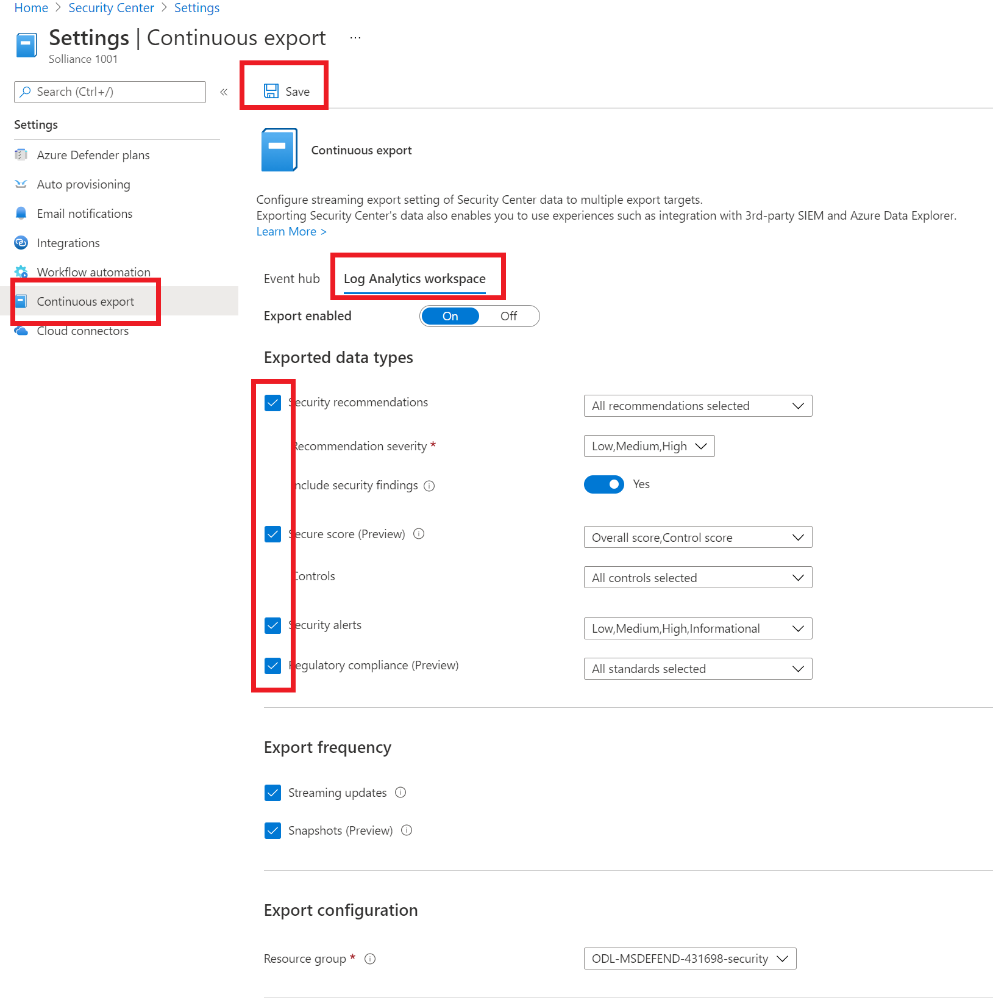

# Azure Security Center + Azure Defender Setup : Lab 2 : Execute Azure Defender Protections

## Exercise 1: Network Map

### Task 1: Network Map

1. Open the Azure Portal
2. Search for Azure Security Center
3. Select **Azure Defender**
4. Select **Network Map**
5. Select the **wssecuritySUFFIX-win10** virtual machine node, review the recommendations
6. Select the **Management ports of virtual machines should be protected with just-in-time network access control** recommendation
7. Select **Fix**
8. Select **Save**
9. Navigate back to the Network map via the bread crumb
10. Select the **wssecuritySUFFIX-hub** virtual network node, review the recommendations
11. Select the **DDoS Protection Standard should be enabled** recommendation
12. Select **Take Action**
13. Select **Enable**
14. Select the **wssecuritySUFFIX** protection plan
15. Select **Save**

## Exercise 2: Azure Defender KQL Queries

### Task 1: VM Vulnerability Assessment

1. Open the Azure Portal
2. Browse to **Security Center**
3. Under **General**, select **Recommendations**
4. Under the **Controls** section, expand the **Remediate vulnerabilities**
5. Select the **Vulnerabilities in your virtual machine should be remediated** item, you should see a set of recommendations.

    

6. In the Azure Portal, search for **Resource Graph Explorer**
7. In the query window, run the following query:

        ```kql
        securityresources 
        | where type =~ "microsoft.security/assessments/subassessments"
        | extend assessmentKey=extract(@"(?i)providers/Microsoft.Security/assessments/([^/]*)", 1, id), subAssessmentId=tostring(properties.id), parentResourceId= extract("(.+)/providers/Microsoft.Security", 1, id)
        | extend resourceId = tostring(properties.resourceDetails.id)
        | extend subAssessmentName=tostring(properties.displayName),
            subAssessmentDescription=tostring(properties.description),
            subAssessmentRemediation=tostring(properties.remediation),
            subAssessmentCategory=tostring(properties.category),
            subAssessmentImpact=tostring(properties.impact),
            severity=tostring(properties.status.severity),
            status=tostring(properties.status.code),
            cause=tostring(properties.status.cause),
            statusDescription=tostring(properties.status.description),
            additionalData=tostring(properties.additionalData)
        | where assessmentKey == "1195afff-c881-495e-9bc5-1486211ae03f"
        | where status == "Unhealthy"
        | summarize numOfResources=dcount(resourceId), timeGenerated=arg_max(todatetime(properties.timeGenerated), additionalData) by assessmentKey, subAssessmentId, subAssessmentName, subAssessmentCategory, severity, status, cause, statusDescription, subAssessmentDescription, subAssessmentRemediation, subAssessmentImpact
        | extend high = iff(severity == "High", 3,0), medium = iff(severity == "Medium", 2, 0), low = iff(severity == "Low", 1 ,0)
        | extend all = high + medium + low
        | order by all desc, numOfResources desc
        ```

8. You should see the same results as in the Azure Portal.

### Task 2: SQL Vulnerability Assessment

1. Open the Azure Portal
2. Browse to **Security Center**
3. Under **General**, select **Recommendations**
4. Under the **Controls** section, expand the **Remediate security configurations**
5. Select the **SQL databases should have vulnerability findings resolved** item, you should see a set of recommendations.

    

6. In the Azure Portal, search for **Resource Graph Explorer**
7. In the query window, run the following query:

        ```kql
        securityresources 
        | where type =~ "microsoft.security/assessments/subassessments"
        | extend assessmentKey=extract(@"(?i)providers/Microsoft.Security/assessments/([^/]*)", 1, id), subAssessmentId=tostring(properties.id), parentResourceId= extract("(.+)/providers/Microsoft.Security", 1, id)
        | extend resourceIdTemp = iff(properties.resourceDetails.id != "", properties.resourceDetails.id, extract("(.+)/providers/Microsoft.Security", 1, id))
        | extend resourceId = iff(properties.resourceDetails.source =~ "OnPremiseSql", strcat(resourceIdTemp, "/servers/", properties.resourceDetails.serverName, "/databases/" , properties.resourceDetails.databaseName), resourceIdTemp)
        | where assessmentKey == "82e20e14-edc5-4373-bfc4-f13121257c37"
        | extend subAssessmentName=tostring(properties.displayName),
            subAssessmentDescription=tostring(properties.description),
            subAssessmentRemediation=tostring(properties.remediation),
            subAssessmentCategory=tostring(properties.category),
            subAssessmentImpact=tostring(properties.impact),
            severity=tostring(properties.status.severity),
            status=tostring(properties.status.code),
            cause=tostring(properties.status.cause),
            additionalData=tostring(properties.additionalData)
        | summarize
                numOfResources=dcount(resourceId),
                (subAssessmentNameLatest, subAssessmentName)=arg_max(todatetime(properties.timeGenerated), subAssessmentName),
                (subAssessmentCategoryLatest, subAssessmentCategory)=arg_max(todatetime(properties.timeGenerated), subAssessmentCategory),
                (severityLatest, severity)=arg_max(todatetime(properties.timeGenerated), severity),
                (subAssessmentDescriptionLatest, subAssessmentDescription)=arg_max(todatetime(properties.timeGenerated), subAssessmentDescription),
                (subAssessmentRemediationLatest, subAssessmentRemediation)=arg_max(todatetime(properties.timeGenerated), subAssessmentRemediation),
                (subAssessmentImpactLatest, subAssessmentImpact)=arg_max(todatetime(properties.timeGenerated), subAssessmentImpact),
                (causeLatest, cause)=arg_max(todatetime(properties.timeGenerated), cause),
                (additionalDataLatest, additionalData)=arg_max(todatetime(properties.timeGenerated), additionalData),
                timeGenerated=max(todatetime(properties.timeGenerated))
            by assessmentKey, subAssessmentId, status
        | extend high = iff(severity == "High", 3,0), medium = iff(severity == "Medium", 2, 0), low = iff(severity == "Low", 1 ,0)
        | extend all = high + medium + low
        | order by all desc, numOfResources desc
        ```

8. You should see the same results as in the Azure Portal.

### Task 3: File Integrity

1. Open the Azure Portal
2. Browse to the **wssecuritySUFFIX** log analytics workspace
3. Under **General**, select **Logs**
4. Close any dialogs
5. Expand the **Change Tracking** category/solution, notice the two tables `ConfigurationChange` and `ConfigurationData`
6. To find changes to files that contain a path, run the following query:

    ```kql
    ConfigurationChange
    | where ConfigChangeType == "Files" and FileSystemPath contains " c:\windows\system32\drivers\"
    ```

7. To find changes to windows services, run the following query:

    ```kql
    ConfigurationChange
    | where ConfigChangeType == "WindowsServices" and SvcName contains "w3svc" and SvcState == "Stopped"
    ```

8. To find changes to registry settings, run the following query:

    ```kql
    ConfigurationChange
    | where RegistryKey contains @"HKEY_LOCAL_MACHINE\\SYSTEM\\CurrentControlSet\\Services\\SharedAccess\\Parameters\\FirewallPolicy"
    ```

### Task 4: Container Image Scanning

1. Open the Azure Portal
2. Browse to the **wssecuritySUFFIX** log analytics workspace
3. Under **General**, select **Logs**
4. Close any dialogs
5. Run the following query:

    ```kql
    SecurityBaseline
    | where BaselineType == "Docker"
    | where AnalyzeResult == "Failed"
    | summarize arg_max(TimeGenerated, *) by CceId
    | project
        CceId,
        Description,
        Resource,
        ResourceGroup,
        RuleSeverity,
        ActualResult,
        BaselineType,
        Type,
        SubscriptionId,
        TenantId,
        ResourceId,
        ComputerEnvironment
    | order by RuleSeverity asc nulls last
    ```

    

### Task 5: Adaptive Application Control

1. Open the Azure Portal
2. Browse to **Security Center**
3. Under **Cloud Security**, select **Azure Defender**
4. At the bottom of the page, select **Adaptive application control**
5. Select the group
6. Expand the **Recent Alerts** section, select the **Violations audited** item

    

7. In the Azure Portal, search for **Resource Graph Explorer**
8. In the query window, run the following query:

    ```kql
    securityresources
    | where type =~ 'microsoft.security/locations/alerts'
    | where properties.SystemAlertId contains 'application control' or properties.AlertDisplayName contains 'application control' or properties.ResourceIdentifiers contains 'application control'
    | where properties.Status in ('Active')
    | where properties.Severity in ('Low', 'Medium', 'High')
    | extend SeverityRank = case(
        properties.Severity == 'High', 3,
        properties.Severity == 'Medium', 2,
        properties.Severity == 'Low', 1,
        0
        )
    | sort by  SeverityRank desc, tostring(properties.SystemAlertId) asc
    | project-away SeverityRank
    | project id, subscriptionId, AlertDisplayName = properties.AlertDisplayName, AlertType = properties.AlertType, AlertUri = properties.AlertUri, Entities = properties.Entities, Intent = properties.Intent, IsIncident = properties.IsIncident, ResourceIdentifiers = properties.ResourceIdentifiers, Severity = properties.Severity, StartTimeUtc = properties.StartTimeUtc, Status = properties.Status, SystemAlertId = properties.SystemAlertId
    ```

### Task 6: Adaptive Network Hardening

1. In the Azure Portal, search for **Resource Graph Explorer**
2. In the query window, run the following query:

        ```kql
        securityresources 
        | where type =~ "microsoft.security/assessments"
        | extend resourceId = iff(properties.resourceDetails.Source =~ "azure", properties.resourceDetails.Id, iff(properties.resourceDetails.Source =~ "aws", properties.resourceDetails.AzureResourceId, extract("^(.+)/providers/Microsoft.Security/assessments/.+$",1,id)))
        | extend resourceName = extract(@"(.+)/(.+)", 2, resourceId)
        | extend resourceNameLower = tolower(resourceName)
        | extend assessmentKey = name
        | extend assessmentResourceDetails = properties.resourceDetails
        | extend regex_resourceId = extract_all(@"/providers/([^/]+)(?:/([^/]+)/[^/]+(?:/([^/]+)/[^/]+)?)?/([^/]+)/[^/]+$", resourceId)
        | extend providerName = regex_resourceId[0][0],
            mainType = iff(regex_resourceId[0][1] !~ "", strcat("/",regex_resourceId[0][1]), ""),
            extendedType = iff(regex_resourceId[0][2] !~ "", strcat("/",regex_resourceId[0][2]), ""),
            extendedSpecificType = iff(regex_resourceId[0][3] !~ "", strcat("/",regex_resourceId[0][3]), "")
        | extend type = tolower(strcat(providerName, mainType, extendedType, extendedSpecificType))
        | extend statusCode = tolower(properties.status.code)
        | extend statusCause = properties.status.cause
        | extend statusDescription = properties.status.description
        | extend severity = iff(isnotempty(properties.metadata.severity), properties.metadata.severity, "High")
        | extend healthy = iff(statusCode =~ "Healthy", 1, 0),
                low = iff(statusCode =~ "UnHealthy" and severity =~ "Low", 1, 0),
                medium = iff(statusCode =~ "UnHealthy" and severity =~ "Medium", 1, 0),
                high = iff(statusCode =~ "UnHealthy" and severity =~ "High", 1, 0),
                none = iff(statusCode =~ "notApplicable", 1, 0)
        | extend additionalData = iff(isnotempty(properties.additionalData),  properties.additionalData, "{}")
        | extend isResourceGroup = iff(tolower(resourceId) contains "/resourcegroups/" and isnotempty(type) == false, 1, 0)
        | extend isSubscription = iff(tolower(resourceId) contains "/subscriptions/" and isnotempty(type) == false and isResourceGroup == 0, 1, 0)
        | extend type = iff(isnotempty(type) == true, type, iff(isResourceGroup == 1, "$resourceGroup$", iff(isSubscription == 1, "$subscription$", type)))
        | extend securityState = iff(high > 0, 4,
            iff(medium > 0, 3,
            iff(low > 0, 2,
            iff(healthy > 0, 1,
            0))))
        | where assessmentKey in ("f9f0eed0-f143-47bf-b856-671ea2eeed62")
        | project subscriptionId, assessmentKey, resourceName, resourceId, statusCode, type, additionalData, securityState, statusCause, statusDescription, resourceNameLower, assessmentResourceDetails
        | order by resourceNameLower
        ```

### Task 7: JIT VM Access

1. Open the Azure Portal
2. Browse to the **wssecuritySUFFIX** log analytics workspace
3. Under **General**, select **Logs**
4. Close any dialogs
5. To find deletion activities, run the following query:

        ```kql
        AzureActivity
        | where ResourceProviderValue =~ "Microsoft.Security" 
        | where OperationNameValue =~ "Microsoft.Security/locations/jitNetworkAccessPolicies/delete" 
        ```

 6. To find initiation activities, run the following query:

        ```kql
        AzureActivity
        | where TimeGenerated > ago(30d)
        | where OperationNameValue == "Microsoft.Security/locations/jitNetworkAccessPolicies/initiate/action"
        | extend activityStatusValue = toString(Properties d.activityStatusValue)
        | extend eventName = toString(Properties d.eventName)
        | extend Justification = toString(parse json(tostring(Properties d.eventProperties)).Justification)
        | extend User = toString(parse json(tostring(Properties d.eventProperties)).User)
        | summarize count(activityStatusValue) by activityStatusValue, eventName, Justification, User, TimeGenerated, ResourceId
        ```

### Task 8: Network Map

1. Open the Azure Portal
2. Browse to the **wssecuritySUFFIX** log analytics workspace
3. Under **General**, select **Logs**
4. Close any dialogs
5. Run the following PowerShell script:

```PowerShell
. C:\LabFiles\AzureCreds.ps1

$userName = $AzureUserName                # READ FROM FILE
$password = $AzurePassword                # READ FROM FILE
$clientId = $TokenGeneratorClientId       # READ FROM FILE
$global:sqlPassword = $AzureSQLPassword          # READ FROM FILE

$securePassword = $password | ConvertTo-SecureString -AsPlainText -Force
$cred = new-object -typename System.Management.Automation.PSCredential -argumentlist $userName, $SecurePassword

Connect-AzAccount -Credential $cred | Out-Null

$azToken = Get-AzAccessToken;
$token = $azToken.Token;
$global:loginDomain = $azToken.TenantId;

$ropcBodyCore = "client_id=$($clientId)&username=$($userName)&password=$($password)&grant_type=password"
$global:ropcBodyManagement = "$($ropcBodyCore)&scope=https://management.azure.com/.default"

$result = Invoke-RestMethod  -Uri "https://login.microsoftonline.com/$($global:logindomain)/oauth2/v2.0/token" `
    -Method POST -Body $global:ropcBodyManagement -ContentType "application/x-www-form-urlencoded"

$global:managementToken = $result.access_token

$sub = Get-AzSubscription
$subscriptionId = $sub.Id;

$url = "https://management.azure.com/subscriptions/$subscriptionId/providers/Microsoft.Security/topologies?includeResourceInformation=true&api-version=2015-06-01-preview"

$result = Invoke-RestMethod  -Uri $url -Method Get -ContentType "application/json" -Headers @{"Authorization"="Bearer $managementToken"};

$result;

$url = "https://management.azure.com/subscriptions/$subscriptionId/providers/Microsoft.Security/allowedConnections?api-version=2015-06-01-preview";

$result = Invoke-RestMethod  -Uri $url -Method Get -ContentType "application/json" -Headers @{"Authorization"="Bearer $managementToken"};

$result;
```

## Exercise 3: Continuous Export

### Task 1: Enable Continuous Export

1. Browse to Azure Security Center
2. Under **Management**, select **Pricing and settings**
3. Select the lab subscription

    

4. Under **Settings**, select **Continuous export**
5. Select **Log Analytics workspace**
6. Check all the **Exported data types** checkboxes
7. Select the ***-security** resource group
8. For the target workspace, select **wssecuritySUFFIX**

    

9. Select **Save**

    > **Note** You can also deploy continuos export using Azure Policy

10. Browse to the **wssecuritySUFFIX** log analytics workspace
11. Under **General**, select **Logs**
12. Close any dialogs
13. Run the following query to query for security alerts:

    ```kql
    SecurityAlert
    ```

14. Run the following query to query for security recommendations:

    ```kql
    SecurityRecommendation
    ```

## Exercise 4: Azure Defender for IoT

### Task 1: Enable Azure Defender for IoT

1. Open the Azure Portal
2. Browse to the **wssecuritySUFFIX** IoT Hub
3. Under **Security**, select **Overview**
4. Select **Enable**, then refresh the page
5. Select **Settings**
6. Select **Data Collection**
7. For the workspace configuration, toggle to **On**
8. Select the lab subscription
9. Select the **wssecuritySUFFIX** workspace
10. Select **Save**

## Reference Links

- Network Map
