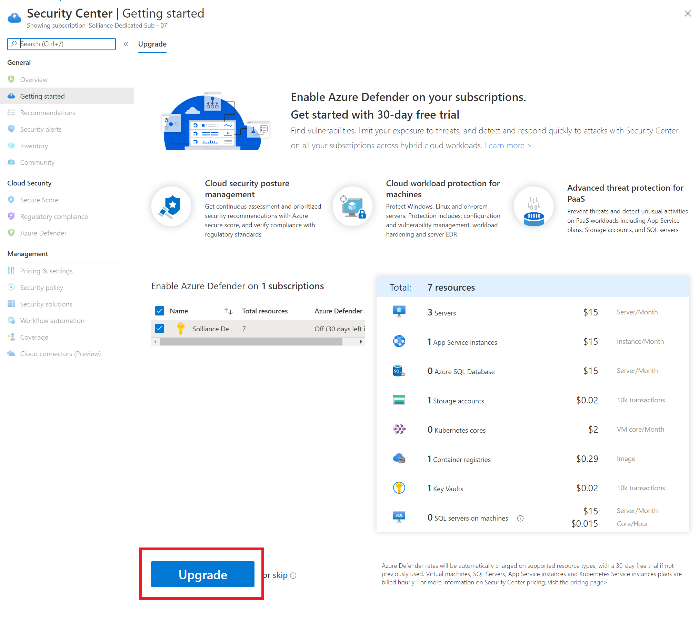
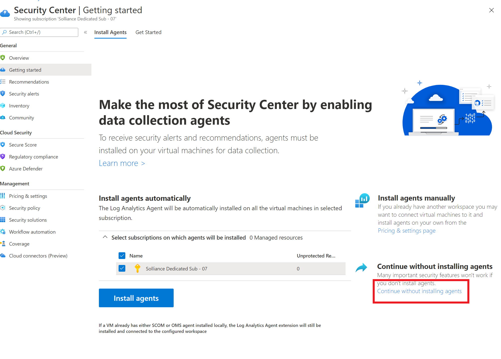
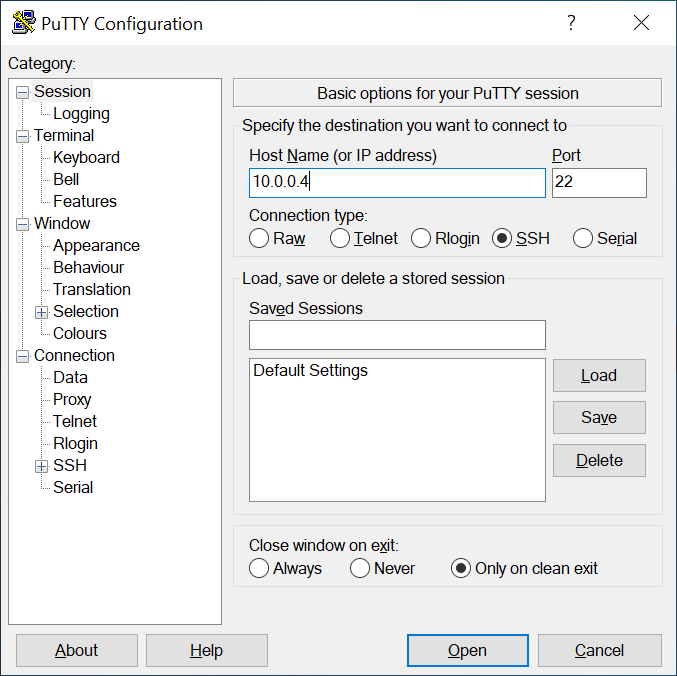
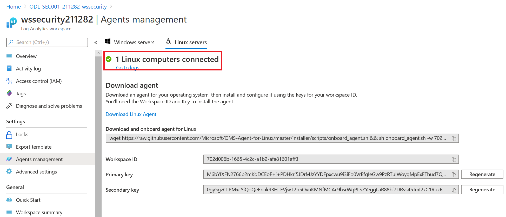
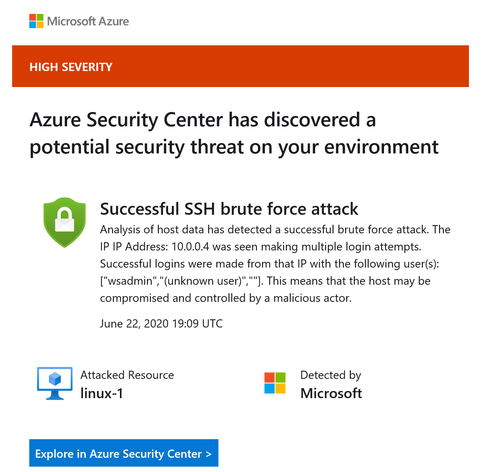
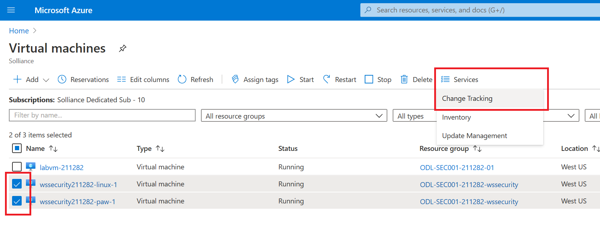
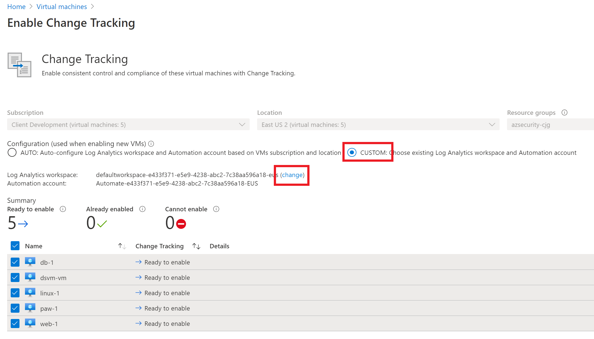
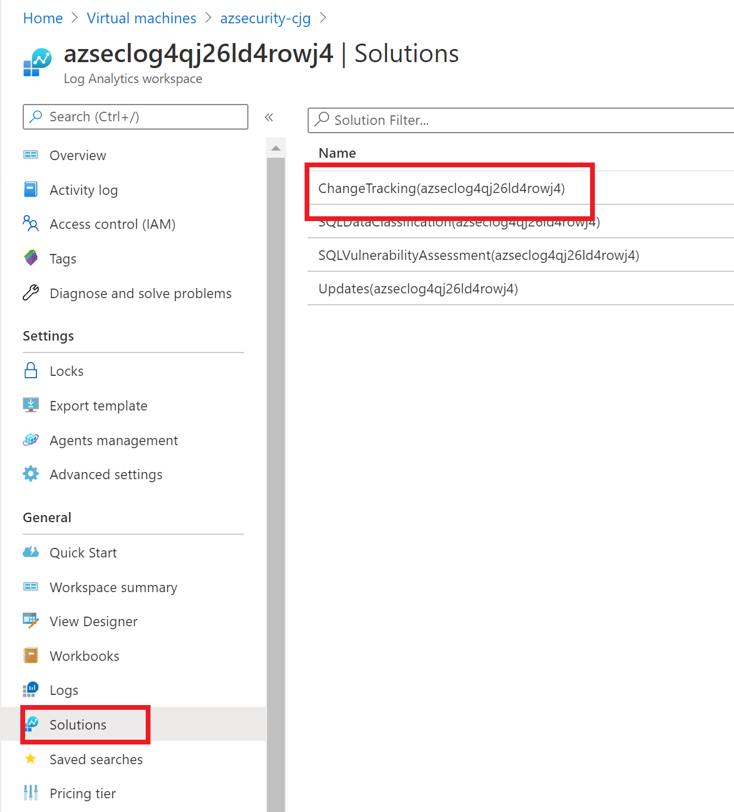
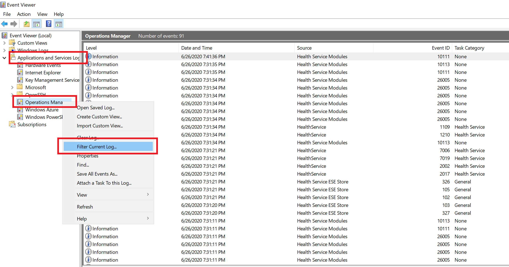
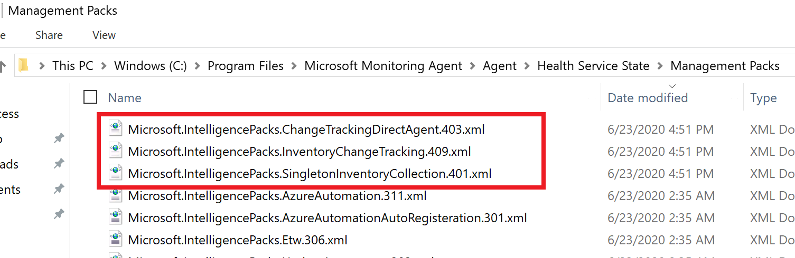

# Azure Security Center + Azure Defender Setup

## Exercise 1: Log Analytics Solutions with Azure Security Center

Duration: 45 minutes

Synopsis: Azure Security Center provides several advanced security and threat detection abilities that are not enabled by default. In this exercise we will explore and enable several of them.

### Task 0: Setup Azure Security Center

1. Open the Azure Portal
2. Search for **Security Center**, select it
3. If you are presented with the getting started page, select **Upgrade**, otherwise skip to Task 1.

    

    > **NOTE** Due to the lab environment, your security center may already be upgraded and this step may not be necessary.

4. Select **Continue without installing agents**

    

5. Under **General**, select **Security Alerts**, if prompted, select **Try Advanced threat detection**
      - Select the **wssecuritySUFFIX** workspace
      - Select **Upgrade**
      - Select **Continue without installing agents**

### Task 1: Linux VM and Microsoft Monitoring Agent (MMA) manual install

1. In the Azure Portal, browse to your **wssecuritySUFFIX** resource group, then select the **wssecuritySUFFIX** **Log Analytics Workspace**.

    

2. In the blade, select **Agents Management**.

3. Record the `Workspace ID` and the `Primary key` values.

   

4. Switch to the Remote Desktop Connection to the **paw-1**. If not logged in, login to the **wssecuritySUFFIX-paw-1** virtual machine

5. Open the **Putty** tool

    > **Note** If putty is not installed, download it from [here](https://the.earth.li/~sgtatham/putty/0.75/w64/).

6. Login to the **wssecuritySUFFIX-linux-1** machine using the `wsuser` username and lab password.  

    - Enter **10.0.0.4** for the IP Address.
    - Select **Open**
    - In the dialog, select **Yes**
    - Enter the **wsuser**
    - Enter the lab password

   

7. Run the following commands, be sure to replace the workspace tokens with the values you records above:

    ```bash
    wget https://raw.githubusercontent.com/Microsoft/OMS-Agent-for-Linux/master/installer/scripts/onboard_agent.sh && sh onboard_agent.sh -w <YOUR_WORKSPACE_ID> -s <YOUR_WORKSPACE_KEY>

    sudo /opt/microsoft/omsagent/bin/service_control restart <YOUR_WORKSPACE_ID>

    ```

8. Switch back to the Azure Portal.

9. In the blade menu, select **Agents Management** and then select **Linux Servers**, you should see **1 LINUX COMPUTER CONNECTED**.

   

   > **Note** In most cases, Azure will assign resources automatically to the log analytics workspace in your resource group.

### Task 2: Execute brute force attack

1. Switch to the Remote Desktop Connection to the **paw-1**.

2. Open a PowerShell ISE Window, in the command prompt area, run the following:

    ```PowerShell
    plink.exe wsuser@10.0.0.4 -pw ABadPassword
    ```

3. Select **Y** in the plink window

4. Open the `C:\LabFiles\security-workshop\Artifacts\BruteForce.ps1` script.

5. Run the script, notice how it will execute several attempts to login via SSH to the **wssecuritySUFFIX-linux-1** machine using the plink tool from putty.

6. After a few moments (up to 30 mins), you will see an alert from Security Center about a successful brute force attack.

    - Navigate to Security Center
    - Select **Security Alerts**

    

### Task 3: Enable change tracking and update management

1. Switch back to the Azure Portal.
2. In the search menu, type **Virtual Machines**, then select it.
3. Highlight the **wssecuritySUFFIX-paw-1**, **wssecuritySUFFIX-linux-1** virtual machines that were deployed.
4. In the top menu, select **Services**, then select **Change Tracking**.

   

5. Select the **CUSTOM** radio button.
6. Select **change**, select matching region
7. Select the **Log Analytics Workspace** that was deployed with the lab ARM template.

    

    > **NOTE** If you do not pre-link an automation account, this blade dialog will not deploy a link reliabiliy.  You should do this before you create log analytic services. See [Region Mappings](https://docs.microsoft.com/en-us/azure/automation/how-to/region-mappings) for more information.

8. Select all the virtual machines, then select **Enable**.
9. Navigate back to the **Virtual Machines** blade, again highlight the **paw-1** and **linux-1** virtual machines that were deployed.
10. In the top menu, select **Services**, then select **Inventory**.
11. Select the **CUSTOM** radio button.
12. Select **change**, select the **Log Analytics Workspace** that was deployed with the lab ARM template.
13. Notice that all the VMs are already enabled for the workspace based on the last task.
14. Navigate back to the **Virtual Machines** blade, again, highlight the **paw-1** and **linux-1** virtual machines that were deployed.
15. In the top menu, select **Services**, then select **Update Management**.
16. Select the **CUSTOM** radio button.
17. Select **change**, select the **Log Analytics Workspace** that was deployed with the lab ARM template.
18. Select all the virtual machines, then select **Enable**.
19. Browse to your resource group, then select your Log Analytics workspace.
20. Under the **General** section, select the **Solutions** blade, you should see the **ChangeTracking** and **Updates** solutions were added to your workspace.
21. Select the **ChangeTracking** solution.

    

22. Under **Workspace Data Sources** section, select **Solution Targeting (Preview)**.
23. Remove any scopes that are displayed via the ellipses to the right of the items.
24. Repeat the steps to remove the solution targeting for the **Updates** solution.

### Task 4: Review MMA configuration

1. Switch to the Remote Desktop Connection to the **wssecuritySUFFIX-paw-1** virtual machine.
2. Open **Event Viewer**.
3. Expand the **Applications and Services Logs**, then select **Operations Manager**.
4. Right-click **Operations Manager**, select **Filter Current Log**.

    

5. For the event id, type **5001**, select the latest entry, you should see similar names to all the solutions that are deployed in your Log Analytics workspace including the ones you just added:

    

6. Open **Windows Explorer**, browse to **C:\Program Files\Microsoft Monitoring Agent\Agent\Health Service State\Management Packs** folder

7. Notice the management packs that have been downloaded that correspond to the features you deployed from Azure Portal:

    

### Task 5: Connect Azure Activity Log

1. Switch to the Azure Portal
2. Browse to your **wssecuritySUFFIX** Log Analytics workspace
3. Under **Workspace Data Sources**, select **Azure Activity Log**
4. Select your lab **Subscription**
5. Select **Connect**

## Reference Links

- [Azure Security Center](https://docs.microsoft.com/en-us/azure/security-center/security-center-intro)
- [Overview of Azure Monitor agents](https://docs.microsoft.com/en-us/azure/azure-monitor/platform/agents-overview)
