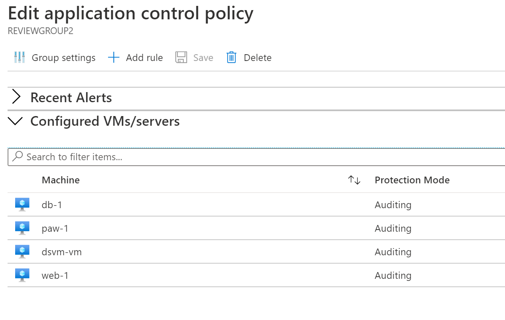

# Execute Azure Defender Protections

- Topics
  - Adaptive Application Controls
  - File Integrity Monitoring
  - SQL Vulnerability
  - Container and Container Image Scanning
  - Just In Time Access
  
## Exercise 1: Adaptive Application Controls

### Task 1: Adaptive Application Controls

1. Switch to the Azure Portal.
2. Search for Virtual Machines, then select it
3. Select all virtual machines, then select **Services->Inventory**
4. Select the **CUSTOM...** radio button, then browse for your **wssecuritySUFFIX** log analytics workspace
5. Select **Enable**
6. Select all virtual machines, then select **Services->Update Management**
7. Select the **CUSTOM...** radio button, then browse for your **wssecuritySUFFIX** log analytics workspace
8. Select **Enable**
9. Search for and select **Azure Security Center**.
10. In the blade menu, scroll to the **Cloud Security** section and select **Azure Defender**
11. Select **Adaptive application controls**.
12. If prompted, select **Try Application Whitelisting**

  - If prompted, select your workspace, then click **Upgrade**
  - Select **Continue without installing agents**

13. You will likely have several groups displayed, find the one that has your newly created lab VMs.

   

14. Expand the **Publisher whitelisting rules** section, you should see that Google Chrome and Notepad++ were picked up and have Microsoft Certificated tied to them

   

15. In the top menu, select **Group settings**.
16. Review the available settings.

> **NOTE** As of June 2020, the **Enforce** option is temporarily disabled.

## Exercise 2: File Integrity Monitoring

### Task 2: File Integrity Monitoring

1. Switch to the Azure Portal.
2. Select Azure Security Center.
3. In the blade menu, scroll to the **Cloud Security** section and select **Azure Defender**
4. Select **File Integrity Monitoring**.
5. For the log workspace tied to your lab environment virtual machines, is displayed, select **Upgrade Plan**

   

6. Select **Try File Integrity Monitoring**.
7. Select the workspace only, then select **Upgrade**.
8. Select the **Continue without installing agents** link.

   

9. If displayed, select **Enable**, then select **Enable File Integrity Monitoring**. If not displayed, simply select the workspace.

    > **NOTE** This can take some time, but is typically within a few minutes

10. Refresh the File Integrity Monitoring page
11. In the menu, select **Settings**.

    

12. Select the **Windows Files** tab.
13. Select **+Add**.
14. For the item name, type **HOSTS**.
15. For the path, type **c:\windows\system32\drivers\etc\\\***.
16. Toggle **Recursion** to **On**
17. Toggle **Upload file content** to **True**
18. Select **Save**.

    

19. Select the **File Content** tab.
20. Select **Link**, then select the storage account tied to your lab.

    > **NOTE** It will take 30-60 minutes for Log Analytics and its management packs to execute on all your VMs. As you may not have that much time with this lab, screen shots are provided as to what results you will eventually get.

    

21. Select **Save**
22. Switch to the Remote Desktop Connection to the **paw-1**.
23. Open the **c:\windows\system32\drivers\etc\hosts** file.
24. Add the following entry:

    ```cmd
    10.0.0.6    linux-2
    ```

25. Save the file.
26. After about 30-60 minutes, the Log Analytics workspace will start to pickup changes to your files, registry settings and windows services.
    - Switch to your Log Analytics workspace
    - Under **General**, select **Logs**
    - Run the following query:

    ```output
    ConfigurationChange
    | where Computer == "paw-1"
    | where ConfigChangeType in("Files", "Registry")
    | order by TimeGenerated
    | render table
    ```

    

27. You will also start to see the file snapshots show up in the storage account:

    

## Exercise 3: VM Vulnerability

### Task 1: VM Vulnerability

1. Switch to the Azure Portal.
2. Open the Azure Security Center
3. Select **Azure Defender**, then scroll down and select **VM vulnerability assessment**
4. Select the checkbox to select all the virtual machines
5. Select **Fix**
6. Select the **Recommended...** radio button, then select **Proceed**
7. In the dialog, select **Fix 6 resources**

  > **Note** After a few hours, the agent will be installed on all selected machines and the assessment data will start to flow into the Security Center.

## Exercise 4: SQL Vulnerability

### Task 1: SQL Vulnerability

1. Switch to the Azure Portal.
2. Browse to the **wssecuritySUFFIX** Azure Database for SQL instance
3. Under **Security**, select **Security Center**, you should see the recommendations and security alerts for the single SQL resource (if any)
4. Select the **(Configure)** link
5. Select the **Select storage account** link, then select the **wssecuritySUFFIX** storage account
6. Select the **Enable Auditing for better threats investigation experience** link
7. Toggle the **Enable Azure SQL Auditing** to **On**
8. Select **Log Analytics** checkbox
9. Select the **wssecuritySUFFIX** log analytics workspace
10. Toggle the **Enable Auditing of Microsoft support operations** to **On**
11. Select **Save**
12. In the Azure Portal, open the Azure Security Center
13. Under **Cloud Security**, select **Azure Defender**
14. Scroll to the bottom, select **SQL Vulnerability Assessment**, you should see all servers across the subscription displayed.

## Exercise 5: Container and Container Image Scanning

### Task 1: Container and Container Image Scanning

1. Log in to the **wssecuritySUFFIX-paw-1** virtual machine
2. Open the Azure Portal to your lab environment
3. Open the **wssecuritySUFFIX** container registry
4. Under **Services**, select **Repositories**, notice there are no images
5. Under **Settings**, select **Access keys**
6. Copy the username and password for later use
7. Open a powerShell window, log in to the **wssecuritySUFFIX-linux-1** virtual machine by running the following:

```bash
ssh wsuser@10.0.0.5
```

6. When prompted, type `yes`, then enter the lab password
7. In the new SSH session, run the following command. This will push an image to the container registry.

  ```PowerShell
  sudo apt-get update

  sudo apt-get install pass gnupg2
  
  sudo apt-get install docker-ce docker-ce-cli containerd.io

  sudo apt-get install apt-transport-https ca-certificates curl gnupg lsb-release

  sudo apt-get install docker-compose

  sudo apt-get install make

  sudo curl -fsSL https://download.docker.com/linux/ubuntu/gpg | sudo gpg --dearmor -o /usr/share/keyrings/docker-archive-keyring.gpg

  echo "deb [arch=amd64 signed-by=/usr/share/keyrings/docker-archive-keyring.gpg] https://download.docker.com/linux/ubuntu $(lsb_release -cs) stable" | sudo tee /etc/apt/sources.list.d/docker.list > /dev/null

  sudo docker pull wernight/bfgminer

  sudo docker pull metal3d/xmrig:latest

  sudo git clone https://github.com/bitcoin/bitcoin.git

  sudo git clone https://github.com/daniel-lima/bitcoin-devenv

  cd bitcoin-devenv

  sudo docker-compose -f docker-compose.yml -f bitcoin/docker-compose.windows.yml build

  sudo docker-compose -f docker-compose.yml -f bitcoin/docker-compose.windows.yml up -d

  sudo docker exec -it bitcoin.windows bash

  cd /projects/bitcoin

  cd depends

  sudo make HOST=x86_64-w64-mingw32

  cd ..

  sudo ./autogen.sh # not required when building from tarball

  CONFIG_SITE=$PWD/depends/x86_64-w64-mingw32/share/config.site ./configure --prefix=/

  sudo make
  ```

7. Push the image to your Azure Container Registry, replace the name, username and password:

```bash
 sudo docker login {acrName}.azurecr.io -u {username} -p {password}

 sudo docker tag bitcoin/windows {acrName}.azurecr.io/bitcoin/windows

 sudo docker tag metal3d/xmrig {acrName}.azurecr.io/metal3d/xmrig

 sudo docker push {acrName}.azurecr.io/bitcoin/windows

 sudo docker push {acrName}.azurecr.io/metal3d/xmrig

```

8. Switch to the Azure Portal, browse to the **wssecuritySUFFIX** Azure Container Registry
9. Under **Services**, select **Repositories**, you should see the **bitcoin/windows** image displayed
10. Under **Services**, select **Security**, ensure the setting is set to **On**
11. Browse to **Azure Security Center**
12. Under **Cloud Security**, select **Azure Defender**
13. Select **Contain Image scanning**, you should see one or more recommendations displayed

## Exercise 6: Just In Time Access

### Task 1: Just In Time Access

1. In a browser, navigate to your Azure portal (<https://portal.azure.com>).
2. Search for **Security Center**, select it
3. Under **Cloud Security** select **Azure Defender**.
4. Scroll to the bottom, select **Just-in-time VM Access**
5. Select the **Configured** tab, and verify the lab VMs are displayed.  If not, select the **Not Configured** tab, and then check the checkbox to select the lab VMs, and then select the **Enable JIT on X VMs** link.
6. In the configuration window that opens, review the settings, then select **Save**.
7. After a few minutes, you should see the virtual machines moved to the **Configured** tab.

### Task 2: Perform a JIT request

1. Select the **paw-1** virtual machine, and then select **Request access**.

    

2. For each of the ports, select the **On** toggle button, notice how the default IP settings is **My IP**.

    

3. At the bottom of the dialog, select **Open ports**. After a few moments, you should now see the **APPROVED** requests have been incremented and the **Last Access** is set to **Active now.**.

    

    > **Note**  If you did not wait for your VMs and virtual networks to be fully provisioned via the ARM template, you may get an error.

4. Select the ellipses, then select **Activity Log**, you will be able to see a history of who requests access to the virtual machines.

    

    > **Note**: These entries will persist after you have deleted the VMs. You will need to manually remove them after VM deletion.

5. In the Azure Portal main menu, select **All Services**, then type **Network**, then select **Network security groups**.

    

6. In the filter textbox, type **paw-1-nsg**, then select the **paw-1-nsg** network security group.

7. Select **Inbound security rules.** You should now see inbound security rules set up by JIT Access.

    

## Exercise 6: Azure Security Center Settings

### Task 1: Azure Defender Plans

1. In a browser, navigate to your Azure portal (<https://portal.azure.com>).
2. Search for and open **Security Center**
3. Under **Management**, select **Pricing & Settings**
4. Select the lab subscription
5. On the Azure Defender Plans, click **Enable all** then select **Save**
6. Select the **wssecuritySUFFIX** resource
7. On the Azure Defender Plans, select **Azure Defender On**
8. Select **Save**
9. Under **Settings**, select **Data collection**
10. Select **Common**
11. Select **Save**

### Task 2: Auto provisioning

1. On the Settings page, select **Auto provisioning**
2. Toggle the **Log Analytics agent for Azure VMs** to **On**
3. In the dialog, select **Connect Azure VMs to a different workspace**
4. Select the **wssecuritySUFFIX** workspace
5. Select **Existing and new VMs**
6. Select **Apply**
7. Toggle the **Microsoft Dependency agent** to **On**
8. Toggle the **Policy Add-on for Kubernetes** to **On**
9. Select **Save**

### Task 3: Continuos Export

1. On the Settings page, select **Continuous export**
2. Review the settings on the page, notice that you can send data to an event hub or to another log analytics workspace.

### Task 4: Cloud Connectors

1. On the Settings page, select **Cloud connectors**
2. Review the settings on the page, notice that you can connect your AWS or GCP cloud accounts

## Reference Links

- [Adaptive Application Controls](https://docs.microsoft.com/en-us/azure/security-center/security-center-adaptive-application)
- [File Integrity Monitoring](https://docs.microsoft.com/en-us/azure/security-center/security-center-file-integrity-monitoring)
