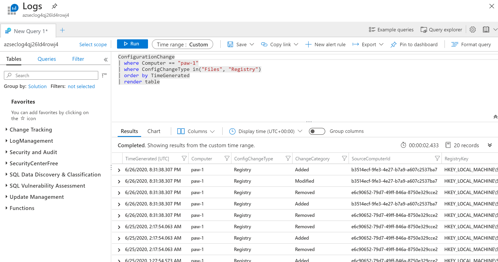

# Defender Office 365

- Topics
  - Spam, Phishing, Malware
  - Quarantine
  - Allow and Block lists
  - Real-time detections
  - Workload protection (SharePoint Online, Teams, OneDrive)
  - Automated Investigation and Response (AIR)
  - Threat Hunting with Threat Explorer and Tracking
  - Attack Simulation

## Exercise 1: Execute Azure Defender Protections

### Task 1: Adaptive Application Controls

1. Switch to the Azure Portal.
2. Select **Azure Security Center**.
3. In the blade menu, scroll to the **Cloud Security** section and select **Azure Defender**
4. Select **Adaptive application controls**.
5. If prompted, select **Try Application Whitelisting**
   - If prompted, select your workspace, then click **Upgrade**
   - Select **Continue without installing agents**
6. You will likely have several groups displayed, find the one that has your newly created lab VMs.

   

7. Expand the **Publisher whitelisting rules** section, you should see that Google Chrome and Notepad++ were picked up and have Microsoft Certificated tied to them

   

8. In the top menu, select **Group settings**.
9. Review the available settings.

> **NOTE** As of June 2020, the **Enforce** option is temporarily disabled.

### Task 2: File Integrity Monitoring

1. Switch to the Azure Portal.
2. Select Azure Security Center.
3. In the blade menu, scroll to the **Cloud Security** section and select **Azure Defender**
4. Select **File Integrity Monitoring**.
5. For the log workspace tied to your lab environment virtual machines, is displayed, select **Upgrade Plan**

   

6. Select **Try File Integrity Monitoring**.
7. Select the workspace only, then select **Upgrade**.
8. Select the **Continue without installing agents** link.

   

9. If displayed, select **Enable**, then select **Enable File Integrity Monitoring**. If not displayed, simply select the workspace.

    > **NOTE** This can take some time, but is typically within a few minutes

10. Refresh the File Integrity Monitoring page
11. In the menu, select **Settings**.

    

12. Select the **Windows Files** tab.
13. Select **+Add**.
14. For the item name, type **HOSTS**.
15. For the path, type **c:\windows\system32\drivers\etc\\\***.
16. Toggle **Recursion** to **On**
17. Toggle **Upload file content** to **True**
18. Select **Save**.

    

19. Select the **File Content** tab.
20. Select **Link**, then select the storage account tied to your lab.

    > **NOTE** It will take 30-60 minutes for Log Analytics and its management packs to execute on all your VMs. As you may not have that much time with this lab, screen shots are provided as to what results you will eventually get.

    

21. Select **Save**
22. Switch to the Remote Desktop Connection to the **paw-1**.
23. Open the **c:\windows\system32\drivers\etc\hosts** file.
24. Add the following entry:

    ```cmd
    10.0.0.6    linux-2
    ```

25. Save the file.
26. After about 30-60 minutes, the Log Analytics workspace will start to pickup changes to your files, registry settings and windows services.
    - Switch to your Log Analytics workspace
    - Under **General**, select **Logs**
    - Run the following query:

    ```output
    ConfigurationChange
    | where Computer == "paw-1"
    | where ConfigChangeType in("Files", "Registry")
    | order by TimeGenerated
    | render table
    ```

    

27. You will also start to see the file snapshots show up in the storage account:

    

### Task 3: SQL Vulnerability

1. Switch to the Azure Portal.
2. TODO

### Task 4: Container Image Scanning

1. Switch to the Azure Portal.
2. TODO

### Task 5: Just In Time Access

1. Switch to the Azure Portal.
2. TODO

## Reference Links

- [Adaptive Application Controls](https://docs.microsoft.com/en-us/azure/security-center/security-center-adaptive-application)
- [File Integrity Monitoring](https://docs.microsoft.com/en-us/azure/security-center/security-center-file-integrity-monitoring)
