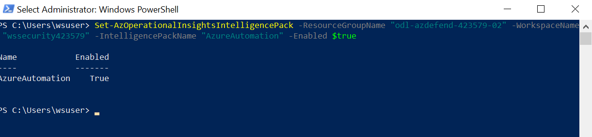
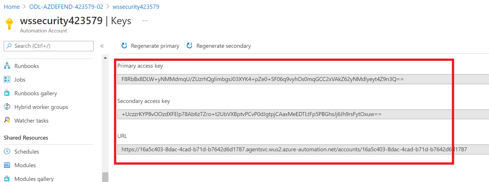
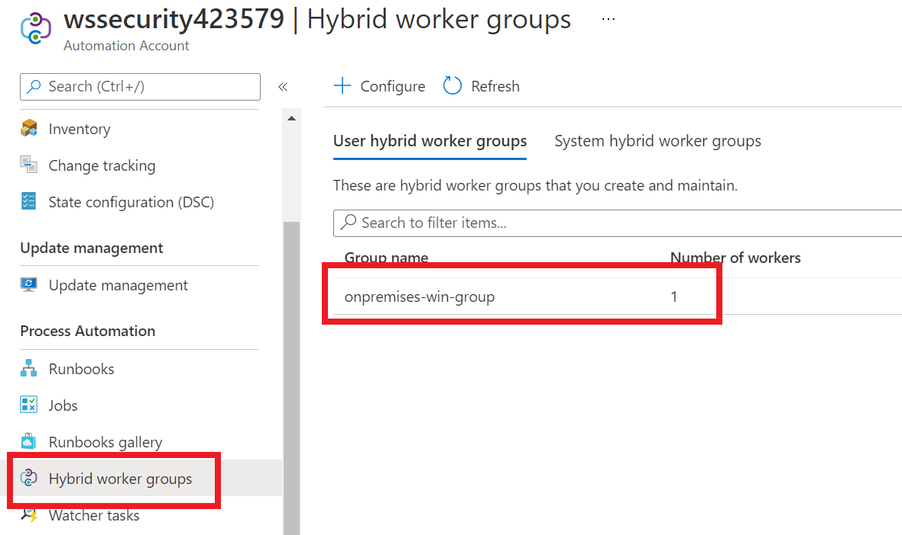
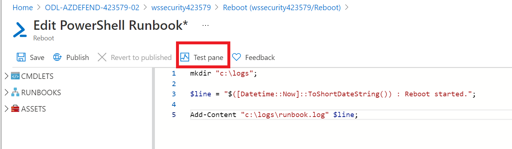
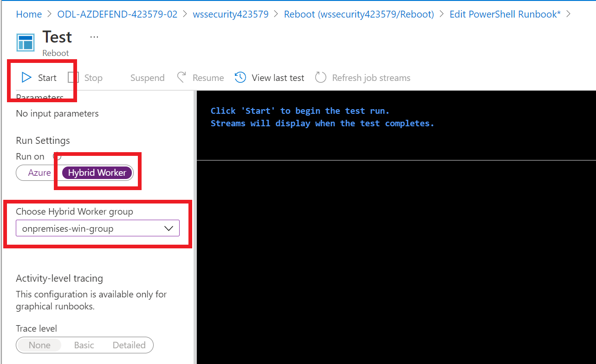

# Setup incident response with on-premises

## Exercise 1: Setup gateway agent

### Task 1: Enable Azure Automation in Log Analytics Workspace

1. Switch to the **wssecuritySUFFIX-paw-1** virtual machine
2. Open a Windows Powershell window, run the following:

```PowerShell
Set-AzOperationalInsightsIntelligencePack -ResourceGroupName "{RESOURCE_GROUP_NAME}" -WorkspaceName "{WORKSPACE_NAME}" -IntelligencePackName "AzureAutomation" -Enabled $true
```



### Task 2: Create Hybrid Worker Group and Worker

1. Browse to the **wssecuritySUFFIX** Azure Automation account
2. Under **Account Settings**, select **Keys**
3. Record the `url` and the `primary access key`

    

4. On the **wssecuritySUFFIX-paw-1** virtual machine, open a Windows Powershell window as administrator
5. Run the following to register the machine, replace the agent version, and the automation account url and key:

```PowerShell
cd "C:\Program Files\Microsoft Monitoring Agent\Agent\AzureAutomation\{VERSION}\HybridRegistration"
Import-Module .\HybridRegistration.psd1

$groupName = "onpremises-win-group";
$url = "{URL}";
$key = "{KEY}";

Add-HybridRunbookWorker –GroupName $groupName -Url $url -Key $key;
```

6. Switch back to the Azure Automation Account
7. Under **Process Automation**, select **Hybrid worker groups**, you should see your new `onpremises-win-group` displayed

    

### Task 5: Execute a Task

1. Under **Process Automation**, select **Runbooks**
2. Select **Create a runbook**
3. For the name, type **Reboot**
4. For the type, select **PowerShell**
5. Select **Create**
6. In the runbook window, paste the following

    ```PowerShell
    mkdir "c:\logs";

    $line = "$([Datetime::Now]::ToShortDateString()) : Reboot started.";

    Add-Content "c:\logs\runbook.log" $line;
    ```

7. Select **Test pane**

    

8. Select **Hybrid worker**, then select **onpremises-win-group**
9. Select **Start**, wait for the test to complete.

    

10. Switch to your virtual machine, browse to the `c:\logs` folder, notice the new `runbook.log` file
11. Switch back to the Automation account, close the test pane
12. Select **Publish**, then select **Yes**
13. Under **Runbook settings**, select **Logging and tracing**
14. Toggle the options to **On**
15. Select **Save**
16. Switch to your VM, in a PowerShell window, run the following:

```PowerShell
Start-AzAutomationRunbook -ResourceGroupName "{RESOURCE_GROUP_NAME}" -AutomationAccountName "{ACCOUNT_NAME}" -Name "Reboot" -RunOn "onpremises-win-group"
```

11. Switch to your virtual machine, browse to the `c:\logs` folder, again open the `runbook.log` file, you should see a newline displayed.

### Task 4: Create a Logic App

1. Create a new Logic App named **Reboot**
2. For the trigger, select **When Azure Sentinel incident creation rule was triggered**
3. Select **Sign in**
4. Select the **+** button in the workspace, then select **Add an action**
5. Search for **Create job** in the **Azure Automation** namespace
6. Select it, then select **Sign in**
7. Select the lab subscription and resource group
8. Select the automation account
9. Add the Hybrid Automation Worker Group parameter, set to `onpremises-win-group`
10. Add the Runbook Name parameter, select **Reboot**
11. Select **Save**

### Task 5: Configure an Alert / Incident

1. Open Azure Sentinel
2. Under **Configuration**, select **Automation**
3. Select **Create->Automation rule**
4. For the name, type **Reboot**
5. For the actions, select **Run playbook**
6. Select the **Reboot** playbook
7. Select **Apply**
8. Open the `CreateIncident.ps1` in Windows PowerShell ISE
9. Update the values in the script, press **F5** to run it
10. Browse back to Azure Portal and Azure Sentinel
11. Select **Incidents**, you should see a new incident

### Task 6: Review Logs

1. Open the `C:\ProgramData\Microsoft\System Center\Orchestrator\{VERSION}\SMA\Sandboxes` directory

> **NOTE** This directory will not exist until the first job has been executed.

2. Review the log files
