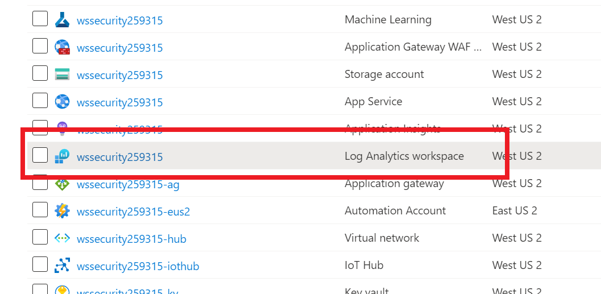
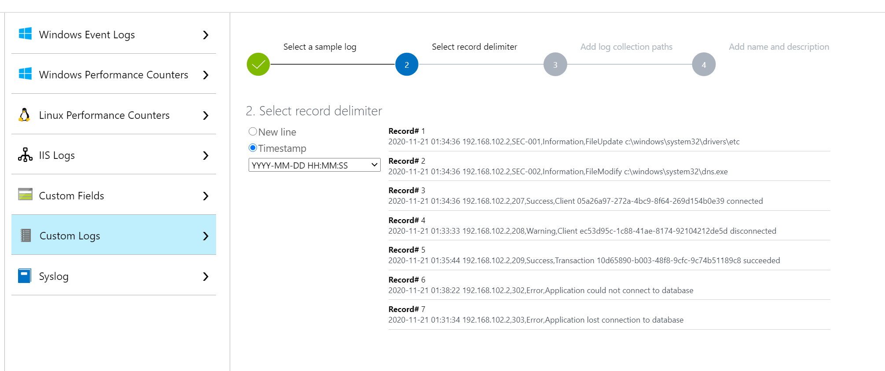
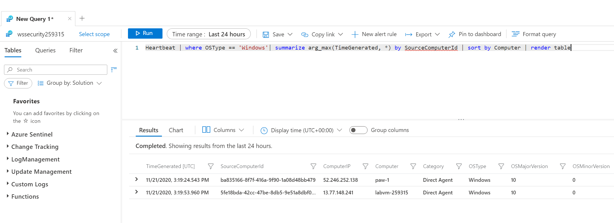
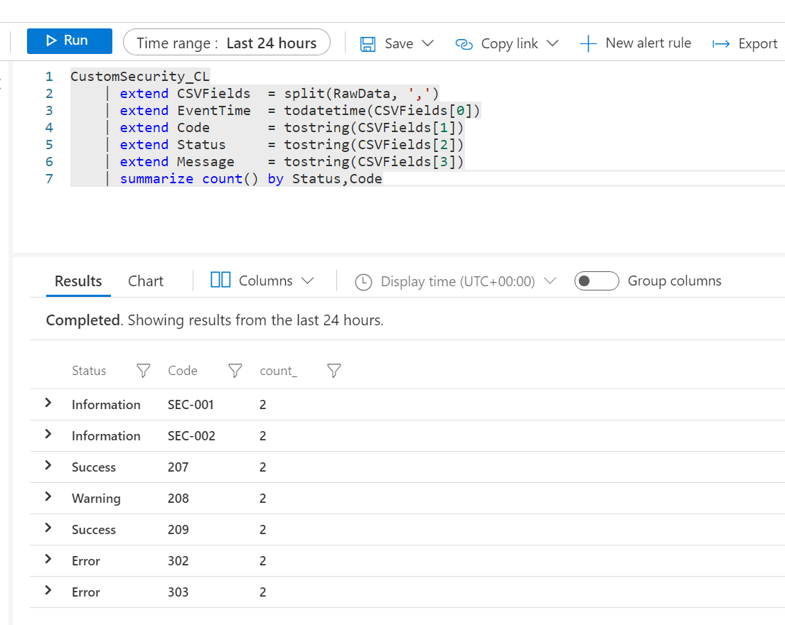
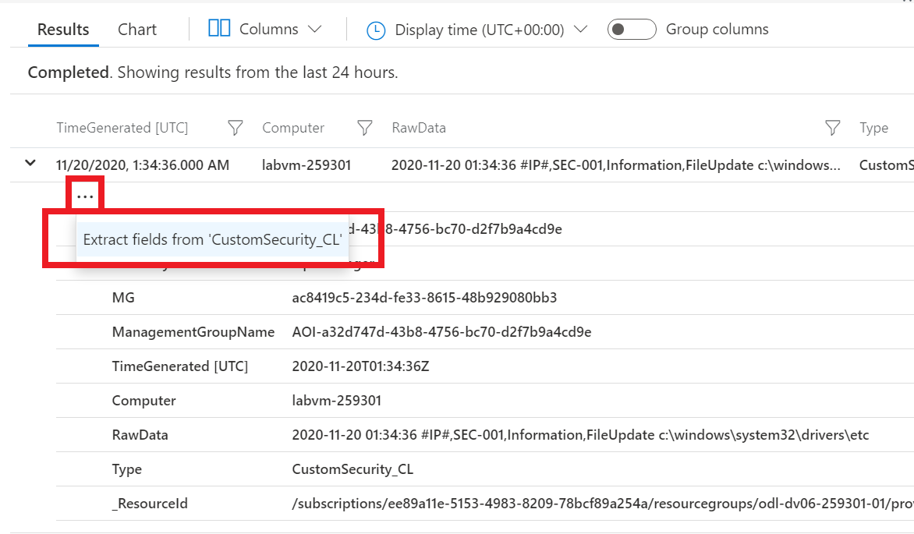
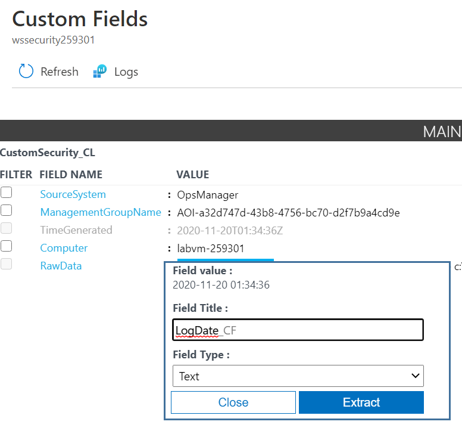
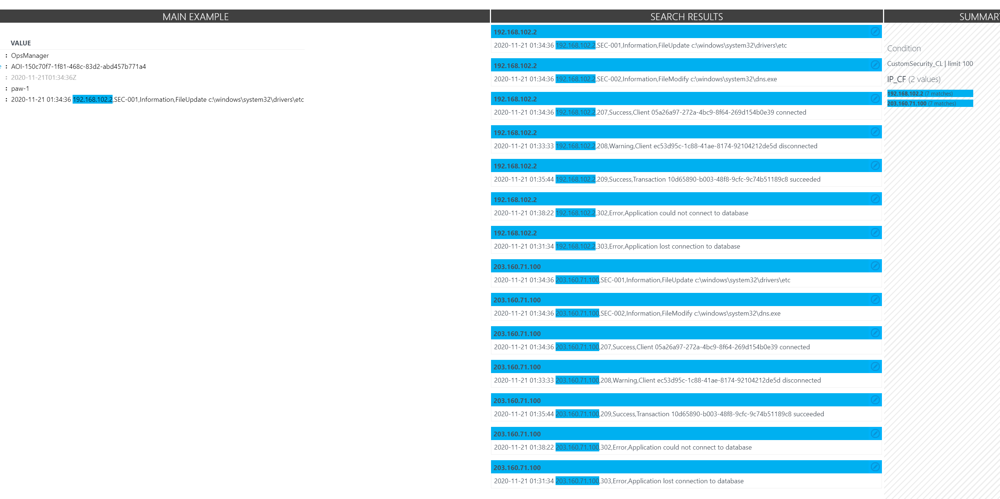
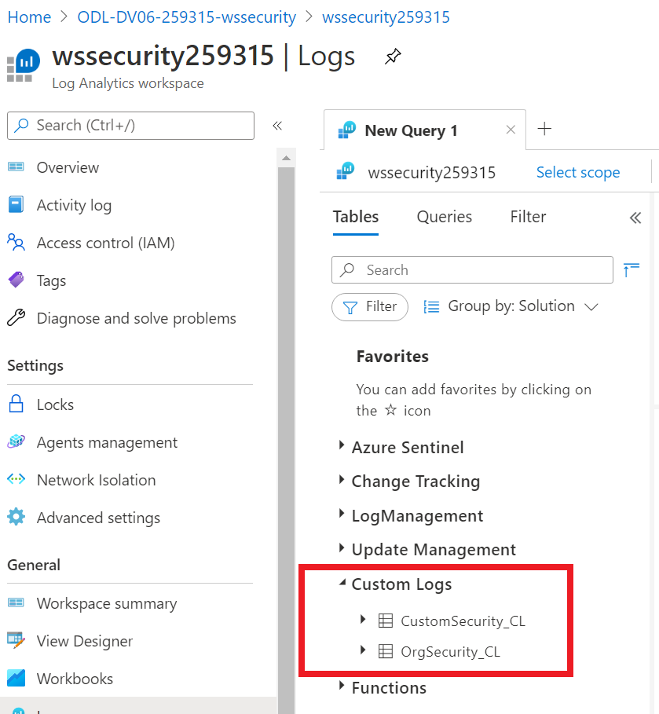
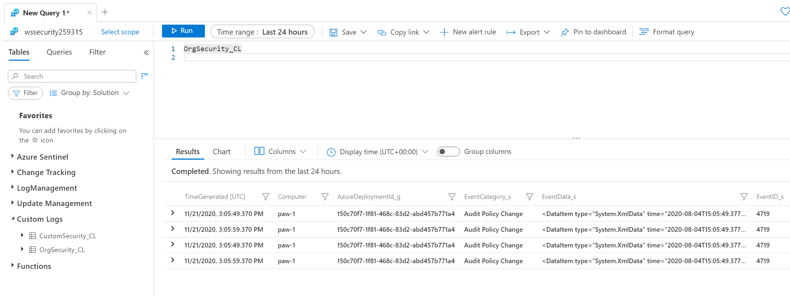
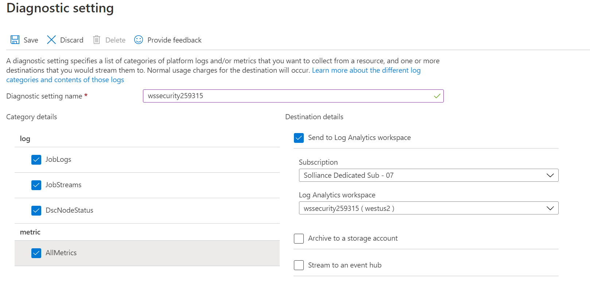

# Azure Security Center + Azure Defender Setup : Lab 2 : Log Analytics Customization

This lab will walk you through how to create custom logs in your host machines and then send those custom logs to Azure Log Analytics.

## Exercise 1: Log Analytics Customization

All of the following tasks (including browsing the Azure Portal) should be performed from the **paw-1** lab virtual machine.

### Task 1: Add custom logs

1. Inside the **wssecuritySUFFIX-paw-1** virtual machine, open the Azure Portal in Chrome.
2. Login using your lab credentials.
3. Browse to the **-wssecurity** resource group.
4. Select the **wssecuritySUFFIX** log analytics workspace.

    

5. Under **Settings**, select **Agents Configuration**.
6. Select **+ Add windows event log**.
7. Type **Application**, then select the **+ Add windows event log** button
8. Type **System**, then select the **+ Add windows event log** button
9. Type **Microsoft-Windows-Sysmon/Operation**, then select the **Apply** button
10. Select the **Windows performance counters** tab
11. Select **Add recommended counters**
12. Select **Apply**
13. Select the **Linux performance counters** tab
14. Select **Add recommended counters**
15. Select **Apply**
16. Under **Settings**, select **Custom logs**.
17. Click **+ Add custom log** to open the Custom Log Wizard.

    > **NOTE** By default, all configuration changes are automatically pushed to all agents. For Linux agents, a configuration file is sent to the Fluentd data collector.

18. Select **Choose File\Browse** and browse to the **c:\lab files\security-defender-workshop-400\artifacts\day-01\logfile.txt** sample file.
19. Select **Next**. The Custom Log Wizard will upload the file and list the records that it identifies.
20. On the `Select record delimiter`, select **Timestamp**
21. Select **YYYY-MM-DD HH:MM:SS**

    

22. Select **Next**
23. For the log collection paths, select **Windows**, then type **C:\logs\\*.log**
24. Select **Next**
25. For the name, type **CustomSecurity**
26. Select **Next**
27. Select **Create**
28. Select **Save**, in the dialog select **OK**
29. Browse back to the log analytics workspace blade
30. Under **Workspace Data Sources**, select **Virtual Machines**
31. Select the **wssecuritySUFFIX-linux-1** machine
32. Select **Connect**.

> **Note** If you get an error, browse to the **wssecuritySUFFIX-linux-1** virtual machine and start it and attempt to connect again.

### Task 3: Generate some log data

1. In the **Paw-1** virtual machine, copy the **c:\lab files\security-defender-workshop-400\artifacts\day-01\logs-01** folder contents to the **c:\logs** folder

### Task 4: Setup Sysmon

1. From the **paw-1** virtual machine, unzip the **c:\labfiles\security-workshop\artifacts\day-01\sysmon.zip** file
2. Right-click it and select **Extract All**, then select **Extract**
3. Open a command prompt, run the following command:

    ```cmd
    cd c:\labfiles\security-defender-workshop-400\artifacts\day-01\sysmon
    sysmon -accepteula -I
    ```

### Task 5: Search custom logs #1

1. Switch back to the Azure Portal and browse to the log analytics workspace
2. Under **General**, Select **Logs**
3. If prompted, select **Get started**, toggle the **Always show Queries** checkbox, then close the dialog that opens
4. In the query text area, type the following:

    ```sql
    Heartbeat | where OSType == 'Windows'| summarize arg_max(TimeGenerated, *) by SourceComputerId | sort by Computer | render table
    ```

5. You should see the **paw-1** machine displayed. If you do not see it, wait for a few more minutes.  Refresh the query until you see the machine displayed as a result.

    

6. In the query text area, type the following:

    ```sql
    CustomSecurity_CL
    ```

    > **NOTE** It could take 5-10 minutes before you see custom log data. Azure Monitor will collect new entries from each custom log approximately every 5 minutes.

7. You should see the following results, notice the **RawData** column.

    

8. You can manually break out the information using Kusto functions. Run the following query:

    ```sql
    CustomSecurity_CL
    | extend CSVFields  = split(RawData, ',')
    | extend EventTime  = todatetime(CSVFields[0])
    | extend Code       = tostring(CSVFields[1])
    | extend Status     = tostring(CSVFields[2])
    | extend Message    = tostring(CSVFields[3])
    | summarize count() by Status,Code
    ```

    

    > **NOTE** We would like to expand this out without having to parse it so we'll create Custom Fields in the next task.

### Task 7: Create Custom Fields

1. Run the following query again:

    ```sql
    CustomSecurity_CL
    ```

2. Expand the first record's properties by clicking the **>**.

3. Select the ellipse to the left of the top property of the record, then select **Extract fields from**.

    

4. The Field Extraction Wizard is opened, and the record you selected is displayed in the Main Example column. The custom field will be defined for those records with the same values in the properties that are selected.

5. Select the Date part of the raw data
6. Type **LogDate_CF** for the field title
7. For the field type, select **Date/Time (ISO 8601 Format)**
8. Select **Extract**

    

9. Select the IP part of the raw data
10. Select **Extract**
11. Select **Save extraction**
12. Select the ellipse to the left of the top property of the record, then select **Extract fields from**.
13. Type **IP_CF** for the field title
14. For the field type, select **Text**
15. Select **Extract**

    

16. Select **Save extraction**

    > **Note** Custom fields will not be applied to any data that already been collected

17. Copy the **c:\lab files\security-workshop\artifacts/logs-02** folder contents to the **c:\logs** folder
18. Run the following query to show data based on a specific IP address:

    ```sql
    CustomSecurity_CL
    | where IP_CF == "203.160.71.100"
    ```

> **Note** You may need to replace the IP with one identified in the logs if it has changed between lab versions.  Also, after adding the custom fields, it may take 15 minutes for the fields to be populated.

### Task 6: Data Collector API

1. Open a PowerShell ISE windows

2. Open the `C:\labFiles\security-defender-workshop-400\artifacts\day-01\DataCollector.ps1` script. Review the script, notice we have replaced the workspace ID and Key for you. Also notice the script uploads a JSON file to the Log Analytics REST API for custom logging purposes.

3. Run the script, press **F5**

    > **NOTE** It will take a short period (5-10 mins) for the Log Analytics workspace to setup the new schema and then make results available.

    

4. Run the following query in your log analytics workspace to see the data you just imported:

    ```output
    OrgSecurity_CL
    ```

    

## Exercise 2: Diagnostic Logging to Log Analytics

Almost every Azure resource has the ability to send `control plane` activities to Log Analytics.  These features are disabled by default and must be enabled through manual or scripted processes.

### Task 1: Enable Diagnostic Logging

1. Browse to your **wssecurity** resource group
2. For each of the following resource types, select it and then under **Monitoring**, select **Diagnostic Logging** in the blade menu
   - Automation Account
   - Container Registry
   - Machine Learning
   - Application Gateway
   - Storage Account
   - App Service
   - Virtual Network
   - Key Vault
3. Once in the Diagnostic logging dialog for each resource, do the following:
   - Select **Add diagnostic setting**
   - Give it a diagnostic setting name such as **wssecurity-{resourcetype}-logging**
   - Check all the checkboxes
   - Select the **Send to Log Analytics workspace** checkbox
   - Select the main log analytics workspace
   - Select **Save**

4. For example, the Azure Automation account has the following items:

    

> **NOTE** Each resource will have different control plane actions that can be logged.  These activities can then be used to create alerts from.

## Exercise 3: Implement Lookups

Azure Sentinel has various methods to perform lookups, enabling diverse sources for the lookup data and different ways to process it.

### Task 1: Use externaldata

1. Open the Azure Portal
2. Browse to the **wssecuritySUFFIX** Log Analytics portal
3. Run the following kql query, be sure to replace the `SUFFIX`:

    ```kql
    externaldata (UserPrincipalName: string) [h"https://wssecuritySUFFIX.blob.core.windows.net/logs/users.csv"] with (ignoreFirstRecord=true)
    ```

4. Review the results, you should see the user name column displayed.
5. Run the following query to do a filter based on the `externaldata` method:

    ```kql
    let timeRange = 1d;
    let allowlist = externaldata (UserPrincipalName: string) [h"https://wssecuritySUFFIX.blob.core.windows.net/logs/users.csv"] with (ignoreFirstRecord=true);
    SigninLogs
    | where TimeGenerated >= ago(timeRange)
    // Exclude non-failure types
    | where ResultType !in ("0", "50125", "50140")
    // Exclude allow-listed users
    | where UserPrincipalName !in~ (allowlist)
    ```

### Task 2: Create Custom Table

1. Switch to the **wssecuritySUFFIX-paw-1** virtual machine
2. Open the `` script in a Windows Powershell ISE window
3. Press **F5** to run the script
4. Switch to your Log Analytics workspace, run the following KQL query

```KQL
users_lookup
```

### Task 3: Create query function

1. Switch to your Log Analytics workspace
2. Select **Logs**
3. Review the following KQL query then run it.  Note how `datatable` is used to create a query time lookup:

    ```KQL
    let Lookup = datatable (UserName:string,DisplayName:string,Risk: int,Location:dynamic)
    [
    'chris@contoso.com','Chris Green',70,'{ "City": "Redmond", "State": "Washintgon", "Country": "US" }',
    'ben@contoso.com','Ben Andrews',100,'{"City": "Oxford", "State": "Oxfordshare", "Country": "UK" }',
    'nir@contoso.com','Nir Cohen',50,'{ "City": "Tel-Aviv", "State": "", "Country": "IL" }',
    'Gabriela@contoso.com','Cynthia Silva',20,'{ "City": "Rio de Janeiro", "State": "Rio de Janeiro", "Country": "BR" }',
    'melissa@contoso.com','Chandana  Agarwals' ,100,'{ "City": "Mumbai", "State": "Maharashtra", "Country": "IN" }'
    ];
    Lookup
    ```

4. In the top navigation, select **Save**
5. For the name, type **users_lookup**
6. For the type, select **Function**
7. For the alias, type **users_lookup**
8. For the category, select **Functions**
9. Select **Save**
10. Run the following query:

```KQL
let allowlist = users_lookup | project UserName
let watchlist = users_lookup | where Risk > 90
```

### Task 4: Create using Storage Account

1. TODO

## Reference Links

- [Azure Monitor](https://docs.microsoft.com/en-us/azure/azure-monitor/overview)
- [Logs in Azure Monitor](https://docs.microsoft.com/en-us/azure/azure-monitor/platform/data-platform-logs)
- [Log Analytics Workspace](https://docs.microsoft.com/en-us/azure/azure-monitor/platform/design-logs-deployment)
- [Log Analytics agent overview](https://docs.microsoft.com/en-us/azure/azure-monitor/platform/log-analytics-agent)
- [Custom logs in Azure Monitor](https://docs.microsoft.com/en-us/azure/azure-monitor/platform/data-sources-custom-logs)
- [Send log data to Azure Monitor with the HTTP Data Collector API (public preview)](https://docs.microsoft.com/en-us/azure/azure-monitor/platform/data-collector-api)
- [Create custom fields in a Log Analytics workspace in Azure Monitor (Preview)](https://docs.microsoft.com/en-us/azure/azure-monitor/platform/custom-fields)
- [Parse text data in Azure Monitor logs](https://docs.microsoft.com/en-us/azure/azure-monitor/log-query/parse-text)
- [Sysmon](https://docs.microsoft.com/en-us/sysinternals/downloads/sysmon)
