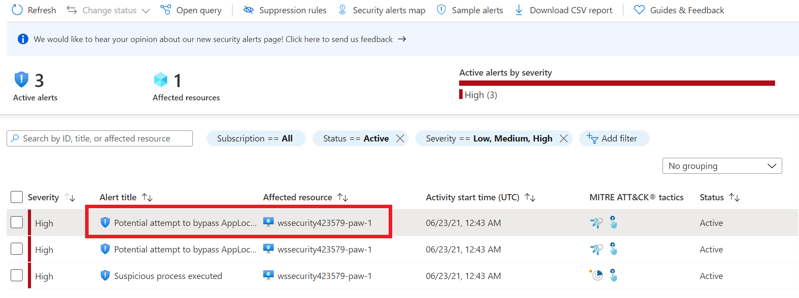

# Sentinel Extensibility + Hunting

- Topics
  - End to end investigation (backwards from sentinel)
  - Perform queries
  - Setup Alerts
  - Perform Investigations
  - Troubleshoot
  - KQL UNIONs
  - SIEM Integration
  - Create bookmarks...

## Notes

- supply chain attack?
  - modify container image
  - upload a bitcoin miner image?

- Execute a brute force attack...concurrent with phishing attack...
- Send email with word document
- embed macro in word document
- have execute powershell script
- download mimikatz
- lateral movement
- encrypt some files in hosts
- set some registry keys

- create custom incident?

## Exercise 1: Execute Attack

You will execute an attack on your paw virtual machine that will do some not so great things. Since your environment has Azure Sentinel configured with all the various data connectors, you should get a basic alert fired. It will be your job to determine what the attack did.

### Task 1: Execute Attack

1. Switch to your **wssecuritySUFFIX-paw-1** virtual machine
2. Open a PowerShell window, run the following, please do not look at the script (it won't help you much anyway):

```PowerShell
`.\artifacts\day-02\Attack_windows.ps1`
```

> **Note** This script will execute some commands that were the result of a hacker gaining access to the credentials of an administrator.  It is up to you to determine how they did it through the next series of exercises.

## Exercise 2: Investigating Incidents and Alerts

The previous exercise created a breach in a system in your environment. You will need to determine what happened and determine what remediation can be done (if any).

### Task 1: Review Alerts

1. Open Azure Security Center
2. Under **General**, select **Security alerts**
3. Select the first alert called **Potential attempt to bypass AppLocker detected**

  

4. Select **View full details**

  

5. Review the alert details

  

6. Can you answer the following questions?
   1. What host did the alert come from?
   2. Who is the user related?
   3. What kind of attack do you think it is?
   4. Where did it come from?

### Task 2: Go Hunting

1. Under Threat Management, select **Hunting**
2. Select **Run all queries**
3. Sort by results delta, review any items that look suspicious

### Task 3: Review Incidents

1. Open Azure Sentinel
2. Under Threat Management, select **Incidents**
3. Do you see any new incidents?
4. Review the Incidents, find any that were recently created (as of when you ran the above attack script)
5. For each incident, select it and then assign yourself (the lab account)

### Task 4: Review Investigation Graphs

1. For each incident, select it, then select **Investigate**, this will display the investigation graph

  > **Note** You'll only be able to investigate the incident if you used the entity mapping fields when you set up your analytics rule. The investigation graph requires that your original incident includes entities. Azure Sentinel currently supports investigation of incidents up to 30 days old.

2. Review the items that are displayed
3. Hover over each entity type, then review the options available to you for that entity type

> **Note** Each entity will reveal a list of questions designed by security experts and analysts to deepen your investigation. These are called exploration queries.

4. Select **Related alerts**, notice any other items are added to the graph

### Task 5: Review Alert Timelines

1. Select the **Timeline** toggle on the right, you should now see the series of alerts and the order in which they were fired

### Task 6: Troubleshoot with KQL

1. What kind of queries do you think you should run to get more details?
2. Try running the following to look for entity related items
3. Run the following KQL to find all entries related to a user:

```KQL
TODO
```

4. Run the following KQL to find all entries related to a device:

```KQL
TODO
```

5. Run the following KQL to find all entries related to an IP address:

```KQL
TODO
```

### Task 7: Answer the Questions

1. Who caused the attack to occur?
2. What entities were involved?
3. What were the steps of the attack?

### Task 8: Close the Incidents

1. For each incident, select it, then select the appropriate status (`closed`) with a classification (`true positive`).
2. For the comment, type `User error in judgement`.
3. Select **Apply**

## Exercise 3 : Use STIX and TAXII with Azure Sentinel

As part of your investigation, you found out someone else had already discovered this attack pattern and published it to a TAXII feed. You want to bring these alerts into your Azure Sentinel for future incident creation.

### Task 1: Create TAXII Connections

1. Open the Azure Portal in your **paw-1** virtual machine
2. Select **Azure Sentinel**
3. Under **Configuration**, select **Data Connectors**
4. Select **Threat Intelligence – TAXII** from the list of the data connectors
5. Click the **Open Connector page** button.
6. For the **Friendly name**, type **Mitre**
7. Enter the API Root, type **https://cti-taxii.mitre.org/stix**
8. For Collection ID, type **95ecc380-afe9-11e4-9b6c-751b66dd541e**
9. For username and password leave blank
10. Click the **Add** button.
11. For the **Friendly name**, type **Anomali**
12. Enter the API Root, type **https://limo.anomali.com/api/v1/taxii2/feeds/**
13. For Collection ID, type **107**
14. For username and password, type **guest**
15. Click the **Add** button.
16. You should now see a confirmation on the notification dialog that the connection was established successfully. The TAXII Server will now show up in the List of the configured TAXII Servers.
17. To view the threat indicators imported into Azure Sentinel, select **Logs**

### Task 2: Create alerts

1. Under **General**, select **Logs**
2. You should now see an **Azure Sentinel** table category displayed
3. Expand it and then expand **ThreatIntelligenceIndicator**. You should now see a list of all the alerts that were imported from the TAXII connectors
4. Under **Threat Management**, select **Threat Intelligence**
5. You should notice several new items displayed based on type and the source (you should see Anomali and Mitre as sources)
6. Select one of the items
7. In the dialog on the right, click the **0 Alerts** area. You will be directed to Log Analytics with the query that represents the item
8. Select **New alert rule->Create Azure Sentinel alert**, follow the dialogs as you have done before in previous labs.
9. Congrats, you have imported external security provider data and created an alert from it using the STIX and TAXII standards.

## Exercise 4 : SOC Efficiency

You would like to measure your SOC efficiency, specifically around Incident response.

### Task 1: Security Operations Efficiency Workbook

1. Under **Threat Management**, select **Workbooks**
2. Search for the **Security operations efficiency** workbook
3. In the dialog, scroll to the bottom, select **Save**
4. Select the region, then select **OK**
5. Select **View template**
6. Select **Auto refresh:Off**, then select **10 minutes**
7. Select **Apply**, you should now see metrics based on your Azure Sentinel incidents
